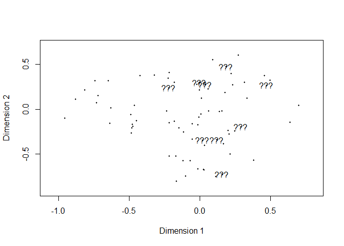
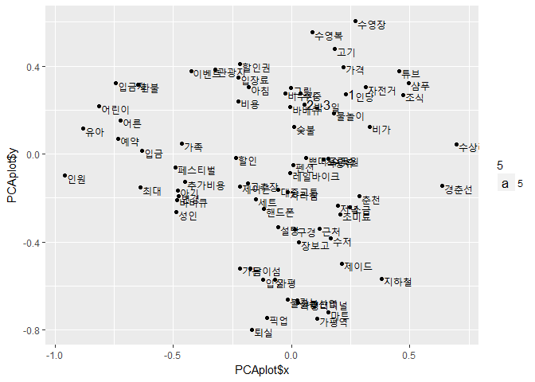

# Word_count
ksg  
2017년 8월 28일  

# 질문속에 어떤 주제들이 있나 알아보자 
## 데이터 로드

```r
library(readxl)
library(stringr)
library(qdapRegex)

qa = read_excel("D:/KMAC_2017/Data_Analysis/data.xlsx")

pre_pro = function(x){
  x = as.character(x)
  # x = gsub("[[:digit:]]"," ", x) #숫자
  x = gsub("[[:punct:]]"," ", x) #기호
  x = gsub("[[:cntrl:]]"," ", x) #제어문자
  x = gsub("[[:space:]]"," ", x) #공백문자
  x = gsub("[[:blank:]]"," ", x) #간격문자
  x = rm_white(x)
}

qa$question = pre_pro(qa$question)
head(qa$question)
```

```
## [1] "안녕하세요 11월 1일에 미로방 예약한 이혜운입니다 저희 숯불 신청 해 놓으려고요 그리고 베드민턴 라켓 등의 운동기구도 사용하고자 하는데 사용이 가능한가요 아 그리고 픽업은 그 날 3시 6시 사이에 역에 도착하면 전화 드리면 되나요 펜션 사진이 너무 좋아서 기대되네요 그럼 답변 부탁드립니다"                                                                                                                                                                                                                                                                                                                             
## [2] "안녕하세요 내일 예약해서 체크인 예정입니다 룸에 기본적인 세면도구가 있는지 궁금해서요 수건 헤어드라이기 샴푸 린스 치약 등등 없으면 챙겨가려고 하는데 답변 부탁드립니다"                                                                                                                                                                                                                                                                                                                                                                                                                                              
## [3] "안녕하세요 잘 지내셨어요 갑자기 아이가 입원하는 바람에 예약을 변경했네요 변경해 주셔서 너무 감사해요 이번주 토요일날 놀러갈 생각에 추운것도 모르겠어요 저희 바베큐 셋트 주문하려구요 2인분 할께요 바베큐셋트하면 숯불가격이 포함인거죠 고기랑 된장찌개랑 밥이랑 야채랑 반찬포함인거죠 2인분 토요일저녁에 먹을 수 있게 준비해주세요 저희가 따로 고기는 조금 더 챙겨가도 되는거죠 1 그날 저녁에 4만원 현금으로 드릴께요 2 숙박비 현금영수증 되나요 되면 부탁좀 드릴께요 그럼 토요일에 뵙겠습니다 저희 혹시 전날 예약없으면 미리 짐 보관 될까요 짐만 넣어놓고 바로 제이드가든으로 가려고요 암튼 추운데 감기조심하시구요"
## [4] "조식 사진이나 메뉴구성에 대한 이야기가 없어서 12월주중에 가려고 합니다 와이파이나 DVD 시청은 가능한가요"                                                                                                                                                                                                                                                                                                                                                                                                                                                                                                             
## [5] "객실내에서 촛불 사용 금지라고 써있는걸 봤는데요 혹시 말씀 드리고 사용할수는 없을까요 티라이트 촛불이라 위험하진 않은데 이벤트용이라 이벤트끝나면 물론 바로 끌꺼구요 답변주세요 ㅎㅎ"                                                                                                                                                                                                                                                                                                                                                                                                                                 
## [6] "안녕하세요 어제 요코방에 묵은 심지은이라고 합니다 제가 핸드폰 충전기를 놓고 온 것 같은데 혹시 보셨나요 가능하시면 착불로 좀 보내주시면 안될까요 6"
```


## TDM생성
  - 단어가 동시에 출현한 빈도를 메트릭스로 만든것
  - tm패키지 TermDocumentMatrix함수
  - 인수로 한국어 토크나이즈 함수를 정해줘야함 

```r
library(KoNLP)
```

```
## Checking user defined dictionary!
```

```r
library(tm)
```

```
## Loading required package: NLP
```

```r
useNIADic()
```

```
## Backup was just finished!
## 983012 words dictionary was built.
```

```r
q_corp = Corpus(VectorSource(qa$question))
q_corp$meta$language="ko"

ko.words = function(doc){
  d = as.character(doc)
  d = str_split(d, ' ')[[1]]  # 띄어쓰기(' ')를 기준으로 단어splt
  d = paste(d[nchar(d) <= 20], collapse = ' ') # 20자 이하인 것만 선택하여 다시 합침
  pos = paste(SimplePos09(d), autoSpacing = T)  # 형태소분석
  extracted = str_match(pos, '([가-힣]+)/[NP]') #형태소중 명사,용언추출
  keyword = extracted[,2]   # 단어만 추출
  keyword[!is.na(keyword)]  # 공백 정리
}

tdm = TermDocumentMatrix(q_corp, 
                         control=list(tokenize=ko.words)) 
                                      #removeNumbers = T,     #2박3일....
                                      #removePunctuation = T, #위에서 전처리
                                      #stopwords = T,         #맥락 손실 우려..
                                      #wordLengths=c(2,Inf))) #술, 방, 물, 밥..
Encoding(tdm$dimnames$Terms)<-"UTF-8"
```
## LSA돌리기
  - 빈출단어 상위 1000개만 가지고 돌림(어차피 다 검토해야되니..)

```r
library(slam)
word.count = as.array(rollup(tdm,2))     #매트릭스 행별 합
word.order = order(word.count, decreasing = T)[1:1000] #많이 쓰인 단어 순서정리(단어번호)
freq.word = word.order[1:1000]           #상위 1000개 단어만 재할당(단어번호)

library(lsa)
```

```
## Loading required package: SnowballC
```

```r
topic.las = lsa(tdm[freq.word,], 15)   #15차원으로 축소
```

```
## Warning in lsa(tdm[freq.word, ], 15): [lsa] - there are singular values
## which are zero.
```

```r
importance = order(abs(topic.las$tk[,1]), decreasing = T) #정렬해서 봄


library(GPArotation)
```

```
## 
## Attaching package: 'GPArotation'
```

```
## The following object is masked from 'package:lsa':
## 
##     entropy
```

```r
tk = Varimax(topic.las$tk)$loadings
```


```r
core_word = read_excel("D:/KMAC_2017/Data_Analysis/word_freq/q_core.xlsx", 1)  #검토해서 뽑은 단어셋
str(core_word)
```

```
## Classes 'tbl_df', 'tbl' and 'data.frame':	265 obs. of  2 variables:
##  $ word: chr  "예약" "바베큐" "펜션" "픽업" ...
##  $ Freq: num  766 368 330 287 225 140 110 110 100 97 ...
```

```r
core_word = core_word[core_word$Freq>5, "word"] #다섯번 이상 나온단어
core_word = unlist(core_word) 

library(LSAfun)
```

```
## Loading required package: rgl
```

```r
PCAplot = plot_wordlist(core_word,tvectors=tk,method="PCA",dims=2)  #LSA결과 PCA로 2차원 축소 및 시각화

library(ggplot2)
```

```
## 
## Attaching package: 'ggplot2'
```

```
## The following object is masked from 'package:NLP':
## 
##     annotate
```

```
## The following object is masked from 'package:qdapRegex':
## 
##     %+%
```

<!-- -->

```r
p = ggplot(PCAplot, aes(PCAplot$x, PCAplot$y, label=row.names(PCAplot))) #지지플랏으로 시각화
p = p + geom_point()
p + geom_text(aes(x=x+0.01, size=5, hjust=0))
```

<!-- -->
```
